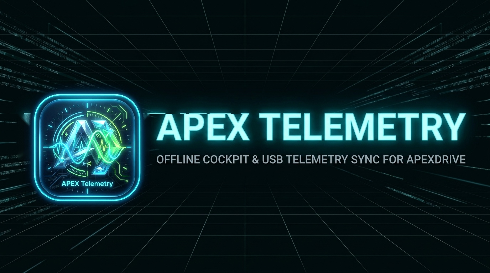

# Apex Telemetry

<div align="center">

### Professional Offline Cockpit & USB Telemetry Sync for ApexDrive

[](https://github.com)
[-0078D6.svg)](https://github.com)
[](LICENSE)
[](AI_DISCLOSURE.md)
[](PRIVACY.md)

</div>

---

## ⚡ Overview

**Apex Telemetry** is an offline desktop cockpit and analysis dashboard built with Electron, tailored specifically for processing electric bicycle telemetry CSV files exported by **ApexDrive**.

It provides deep-dive analytics for ride performance, motor wattage vs. bio-mechanical rider effort, battery discharge curves, thermal profiles, and assist mode distribution. In addition, it integrates a non-destructive, read-only direct USB phone sync engine built on top of the native Windows Portable Devices (WPD) API—eliminating the need for ADB or developer mode.

---

## 🌟 Key Features

### 📊 Comprehensive Telemetry Analytics
Turn raw ride recordings into clear, actionable insights:
* **Interactive Dual Charts**: Synchronized crosshairs and inspectable data points for Speed vs. Motor Power and thermal behavior.
* **Dual Power Metrics**: Compare electrical motor output directly against human bio-mechanical pedaling effort.
* **Battery Consumption**: Compare charge drops across selected sessions, reported in percentage points (pp). Sessions with charging or invalid battery readings are excluded and identified; the total can exceed 100 pp.
* **Single-Session Discharge Chart**: In a single-session view, inspect reported battery charge (%) over time when the session shows at least a 5 pp drop and has valid, uninterrupted readings.
* **Thermal Dynamics**: Monitor motor and controller operating temperatures throughout entire sessions.
* **Assist Mode Distribution**: Visual breakdown of assist mode usage across all your rides.
* **Flexible Filtering**: View aggregated data across all sessions, inspect custom date ranges, or zoom in on single rides.

### 📱 Read-Only USB Phone Sync (No ADB Required)
* **Direct MTP / WPD Integration**: Discover and transfer ride CSV files directly from your connected Android phone via standard USB file transfer.
* **Non-Destructive & Safe**: Never modifies, overwrites, or deletes files on your phone or computer.
* **Duplicate Detection**: Only new, unimported sessions are transferred to your local telemetry workspace.

### 🌓 Clean, High-Contrast Cockpit Design
* **Adaptive Dark & Light Themes**: Seamlessly switch between dark and light themes with instant persistence.
* **Responsive Workspace**: Clean typography, status indicators, and drawer states with persisted window geometry.

---

## 🚀 Getting Started

### Installation
Official pre-compiled binaries are available under the repository's **Releases** tab:
* **ApexTelemetry-Setup-1.0.0.exe**: Standard Windows installer (NSIS) with customizable destination directory.
* **ApexTelemetry-Portable-1.0.0.exe**: Standalone portable executable requiring no installation.

### Quick Start
1. **Launch Apex Telemetry**: Open the application.
2. **Choose Telemetry Folder**: Navigate to **Import data** and choose a local folder where your ride CSV files are stored.
3. **Analyze Sessions**: Return to the **Overview** tab to explore aggregated statistics, metrics, and charts.
4. **Sync from Phone (Optional)**: Plug in your Android phone via USB, enable **File transfer (MTP)**, click **Find phone** under the USB sync panel, and press **Sync CSV files**.

---

## 🔌 USB Phone Synchronization (Windows)

> **Platform Note:** Direct USB phone synchronization is currently implemented for **Windows** using the native Windows Portable Devices (WPD) API. On macOS and Linux, users can import CSV files copied locally to their filesystem.

### Android Setup Steps
1. Connect your Android phone to your PC using a standard USB data cable.
2. Unlock the device and select **File transfer / Android Auto** in the USB connection notification.
   *(Note: Charging-only and Photo transfer (PTP) modes will not allow access to the telemetry folder).*
3. Verify that **Internal storage** appears in Windows File Explorer.
4. In Apex Telemetry, navigate to **Import data**, click **Find phone**, and then select **Sync CSV files**.

### Troubleshooting USB Connectivity
* **Device shows a yellow exclamation mark in Device Manager**:  
  Right-click device $\rightarrow$ **Update driver** $\rightarrow$ **Browse my computer for drivers** $\rightarrow$ **Let me pick from a list of available drivers** $\rightarrow$ **Portable Devices** $\rightarrow$ select **MTP USB Device**.
* **Device disconnects or doesn't appear**: Verify you are using a high-quality USB data cable and a direct USB port (avoid unpowered USB hubs).

---

## 🛠️ Development & Building

### Prerequisites
* **Node.js**: v22.12.0 or later
* **Windows Build Tools**: Visual Studio C++ build environment (MSVC) for compiling the native WPD helper binary (`WpdReader.exe`)

### Setup & Run
```powershell
# Install dependencies
npm install

# Build the native WPD helper and launch the Electron application
npm start
```

### Packaging Binaries
```powershell
# Build Windows installer and portable executable
npm run dist:win

# Build Windows installer only
npm run dist:win:installer

# Build portable executable only
npm run dist:win:portable
```

---

## 🛡️ Privacy & Zero Data Collection

Apex Telemetry operates strictly under a **100% Offline, Zero-Collection Privacy Policy**:
* **Completely Offline**: The application does not contain remote analytics, error-reporting trackers, or remote telemetry collection.
* **Local Data Sovereignty**: All telemetry CSV files and application preferences remain strictly on your local machine.
* For full details, please refer to our [Privacy Policy](PRIVACY.md).

---

## 🤖 EU AI Act & Artificial Intelligence Transparency

In compliance with **Regulation (EU) 2024/1689 (European Union AI Act)**:
* **AI-Assisted Development**: Portions of the codebase, documentation, and structural optimizations for Apex Telemetry were developed with the assistance of Generative AI tools and LLMs under human review and testing.
* **Deterministic Analytics**: The runtime desktop application uses deterministic mathematical and statistical algorithms for parsing telemetry data without black-box neural networks or profiling systems.
* For the full compliance statement and risk categorization, see [AI_DISCLOSURE.md](AI_DISCLOSURE.md).

---

## ⚖️ Legal Disclaimer & Terms of Use

* **"AS IS" Warranty**: This software is provided free of charge on an "AS IS" basis without warranties of any kind.
* **Hardware & Data Safety**: While the USB synchronization engine operates in a non-destructive, read-only mode, the author accepts no liability for device issues, driver conflicts, or data loss.
* For complete terms, liability limitations, and indemnification, please review [DISCLAIMER.md](DISCLAIMER.md).

---

## 📄 License & Distribution Terms

Apex Telemetry is distributed as **Proprietary Freeware (All Rights Reserved)**.
* **Official Binaries**: Releases are provided exclusively as official installers and portable `.exe` packages via GitHub Releases.
* **Restrictions**: Reverse engineering, decompilation, unauthorized modification, or commercial monetization is strictly prohibited.
* For the complete End User License Agreement, see [LICENSE](LICENSE).

---

## 🏷️ Keywords & Search Index

`#apexdrive` `#apextelemetry` `#electron` `#ebike` `#ebike-telemetry` `#tongsheng` `#tsdz2` `#varstrom` `#ekd01` `#wpd` `#windows-portable-devices` `#mtp` `#desktop-dashboard` `#offline-analytics`
